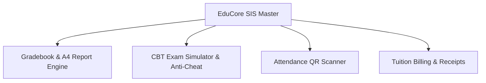

# 🎓 EduCore: School OS & LMS Titan

> **Live Demo:** [https://olyxmintabansos-byte.github.io/educore-os/](https://olyxmintabansos-byte.github.io/educore-os/)

EduCore Titan adalah sistem informasi akademik (SIS/ERP) dan Learning Management System modern yang menggabungkan manajemen data siswa, transkrip raport digital format cetak A4 kop dinas resmi, CBT Exam Simulator ber-timer anti-curang, absensi presensi QR, serta kasir pembayaran SPP.

## 🚀 Fitur Utama
- **Student Information System (SIS):** Direktori master siswa, NISN, wali murid, dan riwayat status akademik.
- **Digital Gradebook & Raport A4:** Cetak rapor digital standar dinas pendidikan lengkap dengan tanda tangan kepala sekolah dan rekapitulasi IPK/IPS.
- **CBT Exam Simulator (Anti-Curang):** Simulator ujian berbasis komputer dengan timer countdown, deteksi pindah tab otomatis, dan penilaian instan berkonfeti.
- **Absensi & Presensi QR Scanner:** Pencatatan kehadiran digital per kelas dengan rekapitulasi persentase kehadiran.
- **Kasir SPP & Keuangan:** Cetak kuitansi pembayaran SPP resmi berstempel LUNAS.

## 🏗️ Diagram Arsitektur

