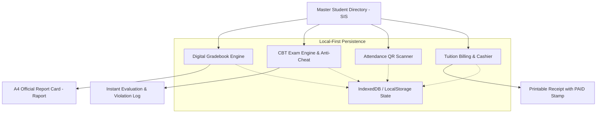

# 🎓 EduCore: School OS & LMS Titan — Academic ERP & CBT Engine

<p align="center">
  
  
  
  
  
  
</p>

> 🚀 **Live Production Application:** [https://olyxmintabansos-byte.github.io/educore-os/](https://olyxmintabansos-byte.github.io/educore-os/)

---

### 🌐 System Overview & Vision

**EduCore Titan** adalah ekosistem terpadu *Academic Enterprise Resource Planning (ERP)*, *Student Information System (SIS)*, dan *Computer-Based Test (CBT) Engine* mutakhir untuk institusi sekolah modern, akademi, dan politeknik vokasi.

Dirancang secara **Client-Side Local-First**, EduCore Titan memadukan pengelolaan ribuan berkas murid, buku nilai digital dengan cetak Raport A4 standar Dinas Pendidikan, simulator ujian CBT bersenjata algoritma anti-curang, pencatatan presensi QR, serta modul kasir pembayaran SPP berstempel resmi tanpa ketergantungan server runtime atau latensi jaringan.

---

### 🌟 Key Functional Pillars

#### 1. 📋 Student Information System (SIS) (`/students`)
- **Master Data Siswa Terpusat:** Direktori lengkap NISN, NIK, nama lengkap, kelas, jurusan vokasi/peminatan, serta kontak wali murid.
- **Filter & Multi-Criteria Search:** Pencarian instan per tingkat kelas, status beasiswa, dan track record keaktifan.
- **Manajemen Berkas:** Profil murid komprehensif yang sinkron dengan buku nilai dan status finansial.

#### 2. 📑 Digital Gradebook & Cetak Raport A4 (`/gradebook`)
- **Buku Nilai Mata Pelajaran:** Rekapitulasi nilai tugas, ulangan harian, UTS, dan UAS dengan pembobotan persentase otomatis.
- **Generator Raport A4 Standar Dinas:** Cetak lembar hasil belajar siswa resmi format kertas A4 siap print/PDF lengkap dengan kop dinas sekolah, predikat capaian kompetensi, catatan wali kelas, dan tanda tangan digital kepala sekolah.

#### 3. ⏱️ CBT Exam Simulator & Anti-Cheat Engine (`/cbt`)
- **Interactive Exam Room:** Simulator ujian berbasis komputer dengan antarmuka minim distraksi, navigasi nomor soal fleksibel, dan countdown timer per detik.
- **Tab-Switching Violation Tracker:** Algoritma deteksi kecurangan yang memonitor saat siswa berpindah tab browser, mencatat jumlah pelanggaran, dan memberikan penalti otomatis.
- **Instant Result & Confetti:** Kalkulasi skor akhir instan dengan visualisasi perolehan nilai dan animasi perayaan pencapaian.

#### 4. 📱 Absensi & Presensi QR Scanner (`/attendance`)
- **Scanner Presensi Digital:** Pencatatan kehadiran harian siswa berbasis pemindaian QR code atau check-in manual cepat per rombel.
- **Rekapitulasi Persentase Kehadiran:** Pelacakan otomatis status Hadir, Izin, Sakit, dan Alpa dengan akumulasi persentase per semester.

#### 5. 💳 Kasir SPP & Kuitansi Keuangan (`/finance`)
- **Billing SPP & Uang Gedung:** Manajemen tagihan biaya pendidikan berkala, status tunggakan, dan histori pembayaran murid.
- **Kuitansi Berstempel LUNAS:** Cetak kuitansi bukti pembayaran sah format siap cetak dengan stempel digital merah LUNAS dan nomor referensi unik.

#### 6. 📊 Executive Academic Dashboard (`/`)
- **Key Metrics Overview:** Total siswa aktif, rasio kelulusan CBT, rata-rata IPK/IPS sekolah, serta rekapitulasi penerimaan kas SPP bulanan.

---

### 🏗️ Architecture & Data Flow



---

### 📁 Directory Layout

```
educore-os/
├── public/
│   └── .nojekyll                 # Jekyll bypass for GitHub Pages
├── src/
│   ├── app/
│   │   ├── attendance/page.tsx   # QR attendance & monthly logs
│   │   ├── cbt/page.tsx          # CBT exam room & anti-cheat engine
│   │   ├── finance/page.tsx      # SPP billing & official receipt
│   │   ├── gradebook/page.tsx    # Digital gradebook & A4 report generator
│   │   ├── students/page.tsx     # Student information system (SIS)
│   │   ├── layout.tsx            # Global layout, navigation sidebar, themes
│   │   └── page.tsx              # Executive academic dashboard
│   ├── components/               # Modular UI components, dialogs & tables
│   ├── lib/                      # Academic calculation algorithms & seeds
│   └── types/                    # Strict TypeScript definitions
├── next.config.ts                # Static export configuration
└── package.json                  # Dependencies & scripts
```

---

### 🛠️ Technology Stack

| Domain | Technology / Library | Rationale |
|---|---|---|
| **Framework** | Next.js 16 (App Router) | High-speed static generation for offline-ready school environments |
| **Language** | TypeScript (Strict Mode) | Zero-defect academic and financial calculations |
| **Styling** | Tailwind CSS v4 | High-performance CSS-first zero-runtime utility styling |
| **Icons & UI** | Lucide React | Clean, intuitive vector iconography |
| **Celebration FX** | Canvas-Confetti | Engaging feedback for students upon exam completion |
| **Persistence** | Local-First Storage | Safe, client-side data isolation without recurring server fees |
| **Deployment** | GitHub Pages (`gh-pages`) | Static hosting with `.nojekyll` bypass |

---

### 🚀 Getting Started & Local Development

Clone repositori dan jalankan pada local development environment:

```bash
# 1. Clone repository
git clone https://github.com/olyxmintabansos-byte/educore-os.git
cd educore-os

# 2. Install dependencies
npm install

# 3. Jalankan development server
npm run dev
```

Buka [http://localhost:3000](http://localhost:3000) pada browser Anda.

#### Build & Static Export

```bash
# Build static export ke direktori out/
npm run build

# Deploy langsung ke GitHub Pages branch gh-pages
npx --yes gh-pages -d out -b gh-pages --dotfiles
```

---

### 📄 License & Attribution

Didistribusikan di bawah lisensi MIT. Silakan gunakan untuk keperluan komersial maupun edukasi.

<p align="center">
  
  
</p>

<p align="center">
  <strong>© 2026 by Olyx (@olyxmintabansos-byte)</strong> • All rights reserved.
</p>
